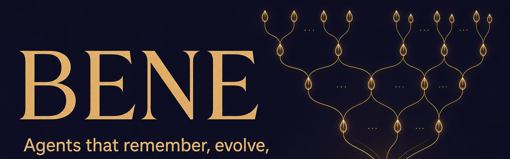

<div align="center">
  <a href="#quick-start-60-seconds">
    
  </a>
</div>

<div align="center">
  <h3>Breeding-program · Evolutionary · Nexus · Engrams</h3>
  <p><b>A Bene Gesserit harness for AI coding agents — they remember, evolve, and never start cold.</b></p>
</div>

<div align="center">

[](https://github.com/good-night-oppie/bene)
[](#development)
[](#architecture)
[](#mcp-server)
[](#grounded-in-research-the-16-aaop-papers)

[**🌐 Live site &amp; docs**](https://agentdex.ai-builders.space/bene/) ·
[Quick Start](#quick-start-60-seconds) ·
[Core Concepts](#core-concepts) ·
[CLI](#cli-reference) ·
[MCP Server](#mcp-server) ·
[Python API](#python-api) ·
[Meta-Harness](#meta-harness)

</div>

<hr>

**BENE puts an AI coding agent's whole run inside one auditable SQLite file** — every file, every tool call, every event — and adds the harness primitives a run needs to be trusted: searchable execution traces (engrams), kill-gated promotion, checkpoints, and a computed trust/autonomy ladder. Use it as a Python library, a CLI, or an MCP server. One file today; Postgres when you outgrow it.

- **One file per run, fully auditable.** Each agent's files, tool calls, and events live in one SQLite database. When something breaks, `sqlite3` into the file and see exactly what happened — no hidden state.
- **Runs that don't start cold.** Every run leaves searchable execution traces (engrams); the next agent inherits the path already walked, and `bene failure localize` finds where a real run went wrong.
- **Gates and trust you can audit.** Promotion needs a sha256-locked probe `ACCEPT` (`PromotionBlocked` otherwise); trust is computed from the audit trail (4 signals + a composite), while autonomy L0–L4 is grant-enforced over a config default floor, and L4 always needs an explicit human grant.

**Honest scope:** the agent loop is turnkey — attach BENE and every turn lands an engram. Everything else (eval gates, memory consolidation, skills, evolution) is real primitives you wire yourself; there is no single adapter that chains all five. The [Integrating BENE](docs/integrating-bene.md) guide is the exact turnkey-vs-wire-yourself map.

📖 **Full docs:** [agentdex.ai-builders.space/bene](https://agentdex.ai-builders.space/bene/) — CLI reference, MCP integration, tutorials, and the benchmark report. New to the name? See [Why the name works](#why-the-name-works) at the end.

## Quick start (60 seconds)

Install from PyPI, then run the keyless demo:

```bash
pip install bene        # or: pipx install bene  ·  uv tool install bene
bene setup              # writes bene.yaml + bene.db (optionally installs the Claude Code MCP entry)
bene demo --no-ui       # seeds the five-capability story — no model keys needed
```

**What you get:** a single SQLite file you can open with any SQLite client. The demo seeds its own throwaway `story.db` and prints the `--db <path>` (plus the seeded `<agent_id>`) to use — copy that path from the demo output:

```bash
bene experiments ls --db <story.db>          # the probe/evolution journal — e.g. story-probe → ACCEPT
bene --json senses                            # what an incoming agent reads first
bene trust <agent_id> --db <story.db>         # computed trust: 4 signals + a composite
```

> **`bene: command not found`?** The install environment's `bin` directory isn't on your `PATH`. Use `pipx install bene` (it puts `bene` on your `PATH` for you), activate the virtualenv you installed into, or add the install bin directory (e.g. `~/.local/bin`) to your `PATH`.
>
> **The MCP install needs `uv`.** If you accept the Claude Code MCP step, `bene setup` writes an entry that launches the server via `uv run --project … bene serve` — so `uv` must be on your `PATH` for the MCP server to start, even when you installed BENE with `pip`/`pipx`. Install [uv](https://docs.astral.sh/uv/) first, or skip the MCP step and run `bene serve --transport stdio` yourself.

## Running agents

Run a single agent:

```bash
bene run "Refactor auth.py for testability" --name refactor-auth
```

Run several agents in parallel — each in its own isolated VFS:

```bash
bene parallel \
  --task security "Review auth.py for security risks" \
  --task tests "Write focused unit tests for auth.py" \
  --task docs "Update the auth module documentation"
```

Inspect the result:

```bash
bene ls
bene status <agent_id>
bene logs <agent_id>
bene read <agent_id> /path/in/agent/vfs
```

## What ships — the BENE 2.0 kernel

> *Everything is an engram.* One typed, append-only, provenance-linked engram
> store carrying five capabilities, with falsifiable gates on everything that
> evolves and an autonomy ladder on everything that acts.

Every 2.0 decision was argued three ways — as science (what would prove this
wrong?), as compression (the smallest representation that still predicts the
data), and as engineering (what breaks at the tail?).

| Capability | What ships in `bene/kernel/` |
| --- | --- |
| **Engram store** | compression ladder (raw trace → episodic → semantic → procedural → strategic), mandatory provenance, lineage queries, FTS |
| **Trust & falsifiable eval** | hash-locked kill-gate probes (tamper → refuse; unkillable → inadmissible), ACCEPT/REJECT/VOID verdicts, experiments journal, **computed** per-agent trust ledger |
| **Evolution engine** | structured genomes, reflective mutation, Pareto frontier, trace→skill distillation, strategy genes — promotion **requires** a probe ACCEPT (`PromotionBlocked` otherwise) |
| **Memory & context OS** | granule consolidation, familiarity-gated fast/slow retrieval, budget-capped context assembly with manifests, context-pollution detection → checkpoint recovery |
| **Harness layer** | autonomy ladder L0–L4 enforced at the capability boundary (L4 needs a human grant), agent-senses manifest generated from the live db, debt sweeper, loop guards |

Legacy 0.1.0 APIs are untouched: the kernel is additive (v2 tables), and
legacy stores mirror into engrams only when explicitly attached
(`bene.kernel.adapters.attach_kernel`).

## Why BENE Exists

AI coding agents are powerful, but ordinary usage leaves too much implicit. Files are shared by convention, failures are hard to reconstruct, useful findings disappear into chat history, and parallel agents can overwrite or duplicate each other's work.

BENE makes agent execution explicit:

| Need | BENE behavior |
| --- | --- |
| Run agents safely in parallel | Each agent writes to its own virtual filesystem. |
| Understand what happened | Events, tool calls, files, and status transitions are recorded. |
| Recover from bad turns | Checkpoints can be listed, diffed, and restored. |
| Reuse what worked | Skills and memories are searchable across agents. |
| Coordinate multiple agents | Shared logs support intent, vote, decision, commit, result, and abort entries. |
| Move work between machines | A run is a portable SQLite database. |

## Core Concepts

### `Bene`

`Bene` is the main Python class. One instance maps to one `.db` file. The database contains agents, files, blobs, events, state, tool calls, and checkpoints.

```python
from bene import Bene

db = Bene("bene.db")
agent_id = db.spawn("reviewer")
db.write(agent_id, "/notes.md", b"Review notes")
print(db.read(agent_id, "/notes.md").decode())
db.close()
```

### Agent Virtual Filesystems

Every agent has a filesystem rooted at `/`, but files are stored in SQLite rows scoped by `agent_id`. Two agents can write the same path without colliding:

```python
a = db.spawn("implementation-agent")
b = db.spawn("test-agent")

db.write(a, "/src/auth.py", b"# implementation")
db.write(b, "/src/auth.py", b"# tests")
```

Per-agent VFS gives logical isolation — reach for an OS sandbox if you don't trust the code. Use this layer to make agent state explicit and auditable.

### Checkpoints

Checkpoints snapshot an agent's files and key-value state. They are useful before risky edits, during long-running agent loops, and when comparing alternate approaches.

```bash
bene checkpoint <agent_id> --label before-refactor
bene checkpoints <agent_id>
bene diff <agent_id> --from <checkpoint_a> --to <checkpoint_b>
bene restore <agent_id> --checkpoint <checkpoint_id>
```

### Events And Logs

BENE records an append-only event history for each agent. The CLI exposes both high-level agent logs and raw SQL for deeper debugging.

```bash
bene logs <agent_id> --tail 100
bene query "SELECT event_type, created_at FROM events ORDER BY event_id DESC LIMIT 20"
```

Use `--json` when scripting:

```bash
bene --json ls
bene --json status <agent_id>
```

## CLI Reference

### Setup And Execution

```bash
bene init                         # create a database
bene setup                        # create bene.yaml and optional MCP config
bene run "task" --name agent      # run one agent
bene run "task" -n agent --ask    # ask clarifying questions first
bene parallel -t a "..." -t b "..."  # run multiple agents
```

### Inspection

```bash
bene ls
bene status <agent_id>
bene logs <agent_id>
bene read <agent_id> /file
bene index <agent_id>
bene search "TODO"
bene query "SELECT * FROM agents"
```

### Checkpoints And Portability

```bash
bene checkpoint <agent_id> --label safe-point
bene checkpoints <agent_id>
bene diff <agent_id> --from <a> --to <b>
bene restore <agent_id> --checkpoint <checkpoint_id>
bene export <agent_id> --output agent.db
bene import agent.db --merge
```

### Interfaces

```bash
bene dashboard                    # terminal dashboard
bene ui                           # web UI
bene demo                         # seeded demo plus UI
bene serve                        # MCP over stdio
bene serve --transport sse --port 8788
```

### Shared Knowledge

```bash
bene memory write <agent_id> "Found retry bug" --type insight --key retry-bug
bene memory search "retry"
bene memory ls

bene skills save \
  --name fastapi_security_review \
  --description "Review a FastAPI service for common security failures" \
  --template "Review {target} for auth, injection, and unsafe deserialization risks."
bene skills search "fastapi security"
bene skills apply 1 --param target=api.py

bene log tail --n 20
bene log ls
```

### Meta-Harness

The meta-harness runs an evolutionary search over harness strategies. It evaluates candidate harnesses on a benchmark, stores traces in the harness VFS, and exposes frontier inspection commands.

```bash
bene mh search --benchmark text_classify --iterations 20 --candidates 3
bene mh search --benchmark math_rag --background
bene mh status <search_agent_id>
bene mh frontier <search_agent_id>
bene mh inspect <search_agent_id> <harness_id>
bene mh resume <search_agent_id> --benchmark text_classify
bene mh lint <search_agent_id>
bene mh knowledge
```

Current CLI benchmark choices are `text_classify`, `math_rag`, and `agentic_coding`.

## MCP Server

BENE exposes its agent lifecycle, VFS, checkpoint, query, memory, skill, shared-log, and meta-harness operations through MCP.

Start the server over stdio:

```bash
bene serve --transport stdio
```

Start the server over SSE:

```bash
bene serve --transport sse --host 127.0.0.1 --port 8788
```

`bene setup` can install a Claude Code MCP entry that runs:

```bash
uv run --project <project_path> bene serve --transport stdio --config-file <bene.yaml>
```

Once installed, an AI coding assistant can ask BENE to spawn agents, inspect outputs, checkpoint work, or run parallel investigations while BENE keeps a durable audit trail.

## Model Providers

Model routing is handled by `TierRouter` (Difficulty-Aware Routing by Tier). A `bene.yaml` file can define one or more models and map work by complexity.

Supported provider values include:

| Provider | Use case |
| --- | --- |
| `claude_code` | Use the Claude Code CLI session. |
| `agent_sdk` | Use the Claude Agent SDK in-process. |
| `anthropic` | Call Anthropic's Messages API with `ANTHROPIC_API_KEY`. |
| `openai` | Call OpenAI or an OpenAI-compatible endpoint with `OPENAI_API_KEY`. |
| `local` | Call a local vLLM, Ollama, or llama.cpp-compatible endpoint. |

Example local configuration:

```yaml
database:
  path: ./bene.db
  wal_mode: true
  compression: zstd
models:
  local-model:
    provider: local
    endpoint: http://localhost:8000/v1
    max_context: 32768
    use_for: [trivial, moderate, complex, critical]
router:
  fallback_model: local-model
  context_compression: true
ccr:
  max_iterations: 100
  checkpoint_interval: 10
  max_parallel_agents: 4
```

## Python API

Use BENE directly when you want a local database-backed agent workspace without the CLI.

```python
import asyncio

from bene import Bene
from bene.ccr.runner import ClaudeCodeRunner
from bene.memory import MemoryStore
from bene.router.tier import TierRouter
from bene.shared_log import SharedLog
from bene.skills import SkillStore


db = Bene("bene.db")
router = TierRouter.from_config("bene.yaml")
runner = ClaudeCodeRunner(db, router)

reviewer = db.spawn("reviewer")
checkpoint_id = db.checkpoint(reviewer, label="before-run")

result = asyncio.run(runner.run_agent(reviewer, "Review auth.py for correctness"))

memory = MemoryStore(db.conn)
memory.write(reviewer, "Auth review completed", type="result", key="auth-review")

skills = SkillStore(db.conn)
skills.save(
    "focused_code_review",
    "Review a file for correctness, security, and test gaps",
    template="Review {target} and return prioritized findings.",
)

log = SharedLog(db.conn)
intent_id = log.intent(reviewer, "publish auth review")
log.decide(intent_id, reviewer)

print(result)
print(checkpoint_id)
db.close()
```

## Architecture

```text
bene/core.py                  Bene VFS engine and public database API
bene/schema.py                SQLite schema
bene/blobs.py                 content-addressed compressed blob storage
bene/events.py                append-only event journal
bene/checkpoints.py           checkpoint, restore, and diff
bene/ccr/runner.py            agent execution loop
bene/ccr/tools.py             tool registry used by agents
bene/router/tier.py           model routing and context compression
bene/router/providers.py      cloud, local, Claude Code, and Agent SDK providers
bene/mcp/server.py            MCP tool surface
bene/metaharness/             evolutionary harness search
bene/memory.py                cross-agent memory store
bene/skills.py                reusable skill library
bene/shared_log.py            coordination log
bene/obsidian/                Obsidian vault export
bene/ui/                      web UI assets and server (incl. engram + trust panels)
bene/cli/main.py              CLI entry point (incl. probe/trust/experiments/senses/sweep)
bene/kernel/                  BENE 2.0 kernel — engrams, bus, capabilities
bene/kernel/eval/             falsifiable probes, kill gates, verdicts
bene/kernel/evolve/           breeding program: GEPA-style evolution, distillation, genes
bene/kernel/memory/           granules, adaptive retrieval, context OS, pollution defense
bene/kernel/harness/          autonomy ladder, senses, sweeper, loop guards
bene/kernel/adapters.py       legacy-store mirrors (attach_kernel)
```

The default storage backend is SQLite with WAL mode. Blob contents are content-addressed and compressed with zstd by default.

## Examples

The `examples/` directory contains runnable examples for common workflows:

- `library_basics.py`: use BENE as a Python library.
- `code_review_swarm.py`: run multiple reviewers in parallel.
- `parallel_refactor.py`: split implementation, testing, and documentation work.
- `self_healing_agent.py`: checkpoint and recover from failed work.
- `memory_search.py`: write and search cross-agent memory.
- `shared_log_coordination.py`: coordinate agents through shared log entries.
- `safety_voting.py`: model a human-in-the-loop safety gate.
- `meta_harness_*.py`: evaluate and improve harness strategies.

Run an example from a checkout of the source repo (the `examples/` directory ships with the repo, not the PyPI package):

```bash
uv run python examples/library_basics.py
```

## Development

Working from a checkout of the framework repo (instead of the PyPI package), use `uv` and prefix CLI commands with `uv run` — e.g. `uv run bene ls` — so they run against the local source without installing:

```bash
uv sync          # set up the environment from the checkout
uv run bene ls   # run the CLI from source
```

Install development dependencies:

```bash
uv sync --extra dev
```

Run tests:

```bash
uv run python -m pytest tests/ -v
```

Run formatting and lint checks:

```bash
uv run ruff format --check .
uv run ruff check .
```

The package requires Python 3.11 or newer.

## Operational Notes

- `BENE_DB` sets the default database path for CLI commands.
- `BENE_CONFIG` sets the default config path for commands that need model routing.
- `--json` produces structured output; it is also enabled automatically when stdout is piped.
- `bene.db` is portable, but live concurrent use depends on SQLite WAL semantics on the host filesystem.
- Agent VFS isolation prevents accidental path collisions inside BENE; external side effects from tools still need normal sandboxing discipline.

## Why the name works

The name nods to Frank Herbert's Bene Gesserit: a Sisterhood whose power is not raw force but patient framework — ancestral memory, knowledge seeded ahead of need, and a multi-generation breeding program. A raw LLM, like a beast, reacts only to what is in front of it and can only destroy; *"兽物的意识无法超越眼前所见……它们，只会毁灭，不会创造……而人，则需框架逻辑，来理解世界。"* A human — and an agent that wants to build rather than merely react — needs a framework. BENE is that framework.

BENE's backronym — **B**reeding-program · **E**volutionary · **N**exus · **E**ngrams — maps one-to-one onto its real features. We started with the Dune metaphor because it actually fit; each motif lines up with a concrete capability. If the metaphor stops carrying weight, we drop it.

| Bene Gesserit motif | What it means in the lore | BENE feature |
| --- | --- | --- |
| **Other Memory** | A Reverend Mother's access to all ancestral memory. | Searchable execution **traces** + trace-based RAG. The next agent inherits every prior run and never starts cold. |
| **Missionaria Protectiva** | Sisters sent ahead to seed protective myths and ideas before they are needed. | **Skills + memory + shared-log**: knowledge seeded ahead of need, propagating across agents. |
| **The Breeding Program** | Patient, multi-generation selection toward a stronger line. | The **evolutionary meta-harness** that breeds better harness strategies on a benchmark, generation after generation. |
| **The Litany Against Fear** | Face the fear, let it pass over and through you, then turn the inner eye to see its path. | **Checkpoints + restore + diff**: face a failed turn, let it pass through, turn the inner eye to its path, and restore. |
| **"Beasts only destroy; humans need frameworks"** | The gom jabbar test: a beast reacts only to what is in front of it; a human builds. | The **harness thesis**: a raw LLM reacts to what is in its context window (the beast); a framework — engrams, checkpoints, kill gates, autonomy ladder — lets the harness build instead of merely react. |

> "I must not fear. Fear is the mind-killer. Fear is the little-death that brings total obliteration. I will face my fear. I will permit it to pass over me and through me. And when it has gone past, I will turn the inner eye to see its path. Where the fear has gone there will be nothing. Only I will remain."
>
> 我需心无所惧。
> 恐惧是思想的屠者，恐惧是渐噬的湮灭。
> 我将直面心之所惧，任它穿略，内观所及。
> 恐惧所经之处，一片虚无。
> 唯我将立。

## Grounded in research: the 16 AAOP papers

Sixteen Agent Auto-Optimization Papers (AAOP) ground the design (paper sources are vendored in the research workspace, not in this repo). Each contributes a concrete idea to one of BENE's capabilities — traces/Other-Memory, skills/Missionaria Protectiva, the evolutionary meta-harness/Breeding Program, harness engineering, or continual/federated learning.

| Paper | Core idea | Informs in BENE |
| --- | --- | --- |
| **Meta-Harness** (Lee et al., Stanford IRIS) — *referenced (vendored in the research workspace, not this repo)* | End-to-end search over the task-specific harness (what to store/retrieve/show) around a frozen base model instead of tuning the model itself. | evolutionary meta-harness (the Breeding Program) + harness engineering |
| **SkillX** (ZJU NLP) — *referenced (vendored in the research workspace, not this repo)* | Distills a strong agent's success traces into a plug-and-play three-level skill hierarchy (planning/functional/atomic) that transfers to weaker agents. | skills & memory propagation (Missionaria Protectiva) |
| **EvoMap / Strategy Genes** (EvoMap × Tsinghua) — *referenced (vendored in the research workspace, not this repo)* | Encode accumulated experience as compact "Gene" control signals rather than sparse skill docs, giving stronger, more stable test-time evolution. | evolutionary meta-harness (the Breeding Program) + skills & memory propagation |
| **Trace2Skill** (Alibaba Qwen-Applications) — *referenced (vendored in the research workspace, not this repo)* | Mine a pool of execution traces in parallel, propose trajectory-local patches with multiple analysts, then hierarchically consolidate into a conflict-free skill directory. | trace-based RAG / Other-Memory |
| **SkillClaw** (Alibaba AMAP / DreamX) — *referenced (vendored in the research workspace, not this repo)* | Collective skill evolution that aggregates multi-user/session/device traces into a stable direction, with nightly validation, so distributed experience compounds. | skills & memory propagation (Missionaria Protectiva) + continual/federated learning |
| **SKILL0 / SkillZero** (Meituan / ZJU-REAL) — *referenced (vendored in the research workspace, not this repo)* | In-context agentic RL that progressively internalizes external skills into the model's own parameters (skill internalization). | continual/federated learning + skills & memory propagation |
| **Skill1** (Meituan / USTC AlphaLab) — *referenced (vendored in the research workspace, not this repo)* | Co-evolves skill selection, utilization, and distillation in one RL policy from a single task-outcome reward via frequency-decomposed credit assignment. | skills & memory propagation (Missionaria Protectiva) |
| **AHE — Agentic Harness Engineering** (Fudan / PKU) — *referenced (vendored in the research workspace, not this repo)* | Observability-driven automatic evolution of all harness components (prompts, tools, middleware, skills, sub-agents, memory) with auditable, git-tracked, falsifiable edits. | harness engineering + evolutionary meta-harness (the Breeding Program) |
| **Continual Harness** (Princeton / Google, Karten et al.) — *referenced (vendored in the research workspace, not this repo)* | Reset-free, in-episode online adaptation where a Refiner CRUD-edits the live prompt/sub-agents/skills/memory mid-run (validated on Pokemon). | continual/federated learning + harness engineering |
| **Ctx2Skill** (Tsinghua) — *referenced (vendored in the research workspace, not this repo)* | Zero-annotation multi-agent self-play loop that discovers/refines context-specific natural-language skills from documents with no external feedback. | skills & memory propagation + context compaction |
| **CoEvolve** (Alibaba AMAP, ACL26) — *referenced (vendored in the research workspace, not this repo)* | Agent-data mutual evolution: failure signals from rollouts synthesize new validated training tasks, closing the loop between policy and its data distribution. | evolutionary meta-harness (the Breeding Program) + continual/federated learning |
| **MUSE-Autoskill** (ByteDance MUSE) — *referenced, not vendored* (wiki idx 12; arXiv 2605.27366) | Gives agents a full skill lifecycle manager that auto-creates, tests, maintains, and evaluates skills (creation/memory/management/evaluation). | skills & memory propagation (Missionaria Protectiva) + checkpoints/recovery |
| **SkillForge** (SIGIR26 Industry, cloud support) — *referenced, not vendored* (wiki idx 13; arXiv 2604.08618) | Uses failure attribution to continually evolve domain-specific cloud-customer-support skills; the only paper with real deployment economics (vertical wedge precedent). | skills & memory propagation + harness engineering (vertical/forward-deployed) |
| **Autogenesis** (NTU, AGP protocol) — *referenced (vendored in the research workspace, not this repo)* | A self-evolving agent protocol (RSPL) modeling prompts/agents/tools/envs/memory as versioned, lifecycle-managed resources so evolution is composable, inspectable, and auditable. | agent isolation/VFS + checkpoints/recovery + shared-log coordination |
| **AEVO / A-Evolve** (HKUST) — *referenced (vendored in the research workspace, not this repo)* | A MetaAgent takes over the evolution mechanism itself to solve long-horizon evolution drift; universal infra to evolve any agent/domain with any evolution algorithm. | evolutionary meta-harness (the Breeding Program) + harness engineering |
| **FedTextGrad** (UBC, ICLR25) — *referenced (vendored in the research workspace, not this repo)* | Federated textual-gradient prompt optimization: clients upload locally TextGrad-optimized prompts and the server aggregates them (privacy-preserving, no numeric loss). | continual/federated learning + shared-log coordination |

## Credits

BENE builds on ideas from agent memory, shared logs, skills, evolutionary harness search, and context compression research. The implementation adapts those ideas into a local-first SQLite runtime with a practical CLI and MCP surface.

Notable influences include:

- `claude-mem` for compact searchable cross-session memory.
- LogAct for shared-log coordination patterns.
- Externalization research on memory, skills, protocols, and harness engineering.
- Meta-harness and evolutionary optimization work for improving agent strategies from execution traces.
- [canivel/KAOS](https://github.com/canivel/KAOS) for the foundational local-first SQLite-backed virtual filesystem and agent orchestration architecture.
