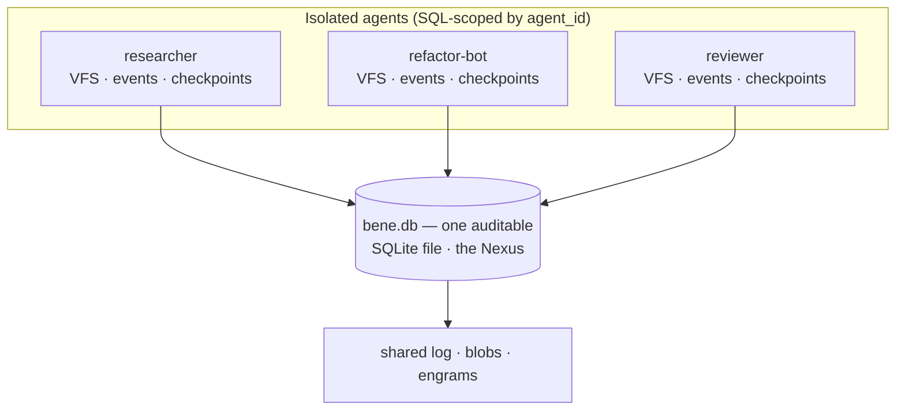
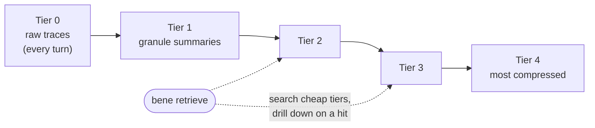
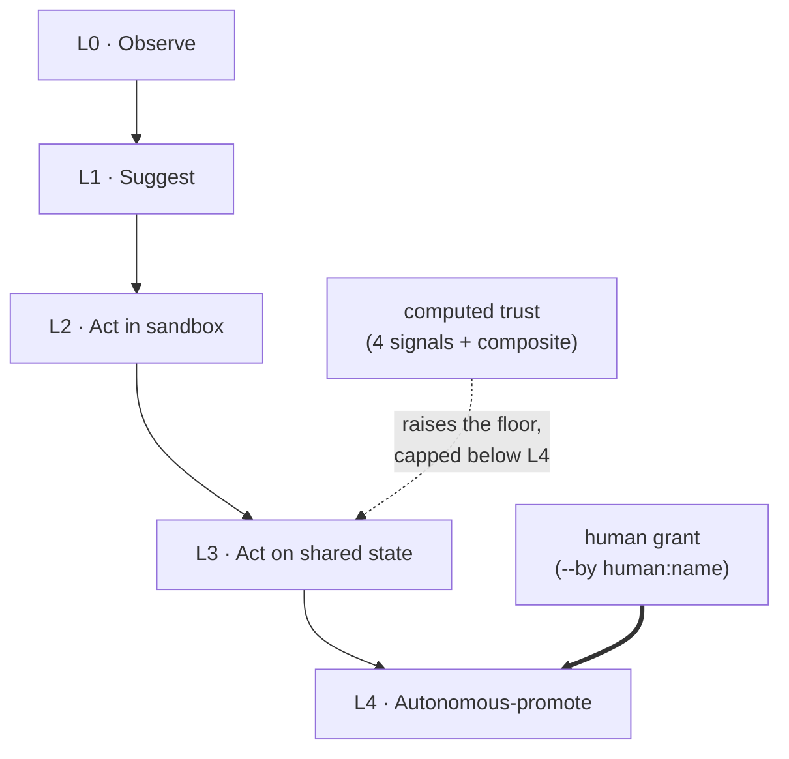

# Architecture diagrams

Three pictures of how BENE fits together: the single-file **Nexus**, the
**engram compression ladder**, and the **autonomy ladder**. Each diagram is the
shape; the prose says what it's load-bearing for.

## The Nexus — many isolated agents, one file

Every agent has its own VFS, event journal, checkpoints, and traces — but they
all live in **one** SQLite database. That single file is the Nexus: the join
point for the whole swarm, and the thing you copy, diff, or check into git.

*Load-bearing:* isolation is enforced at the SQL layer, so "many agents, one
file" never means "agents can read each other." The union is the audit surface.

## The engram compression ladder

Execution traces are stored on a tiered ladder (0–4): raw at the bottom,
progressively compressed summaries above. Retrieval searches the cheap high
tiers first and drills into detail only on a hit — so memory stays searchable as
the corpus grows.

*Load-bearing:* capture is the default (every run drops a tier-0 trace), and the
ladder is what keeps "remember everything" from becoming "scan everything."

## The autonomy ladder (L0 → L4)

Agents operate at a rung. Computed trust (four signals + a composite) raises the
floor an agent is allowed to reach — but the top rung, autonomous promotion, is
**capped below L4 by the engine** and only a human grant crosses it.

*Load-bearing:* autonomy is *earned* from observed behavior, not asserted — and
the one rung that can change the shared world on its own stays a human decision.

---

*Diagrams are Mermaid; the docs site renders them inline. Grounded in
`bene/kernel/harness/autonomy.py` (the L0–L4 labels), the engram tier model, and
the single-file Nexus design. Source: edit this markdown, never the generated
HTML.*
