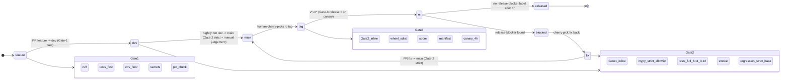

# t10 — Self-Healing CI Overnight: Regression Gate, Auto-Fix, Review and Refactor Swarms

*Tutorial · advanced · 60–90 min*

---

You will wire four small CI jobs into any Python repo:

1. **regression-gate** — fail PRs that regress a measurable signal beyond a threshold.
2. **auto-fix** — apply trivial lint/format fixes and commit on the PR branch.
3. **review-swarm** — 4 parallel reviewers (security, reliability, style, tests).
4. **refactor-swarm** — 1 agent per error-bearing file, advisory only.

Each job is ~100 LOC. You need no new infrastructure: GitHub Actions, `uv`, and an LLM provider key.

For the *why* behind these design choices, see [case-studies/cs02 — Self-Healing CI](../case-studies/cs02-ci-self-healing-refactor-swarm.md). This tutorial is the *how*.

> If any primitive below feels unfamiliar, jump to the linked tutorial first — they are 5–10 min reads and will make this one click without re-reading:
>
> - **`run_parallel`, role split** → [tutorials/t03 — Security Swarm](t03-security-swarm.md)
> - **per-shard rollback** → [tutorials/t02 — End-to-End Self-Healing](t02-e2e-self-healing.md)
> - **threshold gate on a metric** → [tutorials/t07 — Regression Guard](t07-regression-guard.md)
> - **one agent per file at scale** → [tutorials/t08 — 100-Agent Scale](t08-hundred-agents-scale.md)
> - **SQL on the audit DB** → [tutorials/t05 — Incident Response](t05-incident-response.md)

## Prerequisites

- Python repo with GitHub Actions enabled.
- BENE `>=0.1.0` (not yet on PyPI — `uv sync` from a clone, or vendored).
- An LLM provider repo secret (e.g. `ANTHROPIC_API_KEY`).
- CODEOWNERS configured on `.github/workflows/`.

> **Tip.** Run through this tutorial on a throwaway branch first. Each step works on its own; do not wire all four jobs in a single PR.

## Step 1 — Add the runner config

Create `.github/bene/bene-ci.yaml`:

```yaml
# Loaded by CI swarms via BENE_CONFIG.
# NOT under .github/workflows/ on purpose — anything there is auto-run by
# GitHub Actions. Keep under .github/bene/ so CODEOWNERS gates edits without
# the file being treated as a workflow.
provider: anthropic
api_key_env: ANTHROPIC_API_KEY
default_model: claude-sonnet-4-6
router:
  difficulty_thresholds:
    trivial: 0.2
    standard: 0.6
    hard: 0.85
  models:
    trivial:  claude-haiku-4-5
    standard: claude-sonnet-4-6
    hard:     claude-sonnet-4-6
```

Add `.github/bene/` to `CODEOWNERS` so contributor PRs cannot edit it without review.

> **Tip.** Do not put this file at the repo root (any PR can edit it) and do not put it under `.github/workflows/` (GitHub auto-runs every yaml there). `.github/bene/` is a CODEOWNERS-protectable spot that is *not* an Actions workflow path.

## Step 2 — Regression gate (5 min)

`scripts/ci/regression_gate.sh`:

```bash
#!/usr/bin/env bash
set -euo pipefail
: "${BASE_REF:?BASE_REF required}"

git fetch origin "$BASE_REF" --depth 1
git worktree add /tmp/base "origin/$BASE_REF"

base=$(uv run python -m your_pkg.metrics --quiet < /tmp/base)
head=$(uv run python -m your_pkg.metrics --quiet)
delta=$(python -c "print($head - $base)")

echo "base=$base head=$head delta=$delta"
python -c "import sys; sys.exit(1 if $delta < -0.05 else 0)"
```

> **Example.** For a typecheck signal, replace the metric command with `uv run mypy . | grep -c error:` and invert the delta sign.

> **Tip.** Always use `git worktree add`, not `git checkout`. The worktree leaves the active checkout untouched, so the rest of the job can read `HEAD` normally.

## Step 3 — Auto-fix (5 min)

`scripts/ci/auto_fix.sh`:

```bash
#!/usr/bin/env bash
set -euo pipefail
: "${BASE_BRANCH:?BASE_BRANCH required}"

uv run ruff check --fix .
uv run ruff format .

if ! git diff --quiet; then
  git add -A -- '*.py' 'pyproject.toml'
  git -c user.email=ci@example.invalid -c user.name=ci-bot \
    commit -m "ci: auto-fix lint and format [skip ci]"
  git push origin "HEAD:$BASE_BRANCH"
fi
```

> **Tip.** Scope `git add` to the file kinds you actually want to auto-commit. Never `git add -A` blindly — generated files will sneak into commits.

> **Tip.** The `[skip ci]` marker prevents the auto-fix commit from re-triggering the workflow, which is the most common way to create a CI loop.

## Step 4 — Review swarm (15 min)

`scripts/ci/review_swarm.py`:

```python
#!/usr/bin/env python3
"""4 parallel reviewers; artifacts: review-<role>.md."""
import asyncio, os, sys, pathlib
from bene import Bene
from bene.ccr import ClaudeCodeRunner
from bene.router import TierRouter

cfg = pathlib.Path(os.environ["BENE_CONFIG"]).resolve()
if os.environ.get("CI") == "true" and ".github/bene/" not in str(cfg):
    sys.exit("refusing BENE_CONFIG outside .github/bene/")

PAYLOAD = ["scripts/ci/", ".github/workflows/ci.yml",
           ".github/bene/bene-ci.yaml"]
files = "\n\n".join(
    f"# {p}\n{pathlib.Path(p).read_text()}"
    for p in PAYLOAD if pathlib.Path(p).exists()
)

ROLES = {
    "security":    "Find security issues, secret leakage, supply-chain risk",
    "reliability": "Find race conditions, missing retries, untrapped errors",
    "style":       "Review style, naming, and consistency",
    "tests":       "What CI tests are missing? Where is coverage thinnest?",
}

async def main():
    db  = Bene("ci.db")
    ccr = ClaudeCodeRunner(db, TierRouter.from_config(str(cfg)))
    tasks = [
        {"name": role, "prompt": f"{instr}\n\n{files}"}
        for role, instr in ROLES.items()
    ]
    results = await ccr.run_parallel(tasks)

    out = pathlib.Path("review-out"); out.mkdir(exist_ok=True)
    for r in results:
        (out / f"review-{r['name']}.md").write_text(r.get("output", ""))

asyncio.run(main())
```

> **Tip.** Start the swarm payload small — the CI scripts and the workflow file. Once it is reliable, add the diff against `BASE_REF` so reviewers see real PR content.

> **Tip.** Keep role prompts short and orthogonal. Long prompts cause role bleed: the security agent starts critiquing style, the style agent flags missing tests, and you get four similar reviews instead of four different ones.

> **See also.** [tutorials/t03 — Security Swarm](t03-security-swarm.md) shows the same parallel-reviewer pattern and proves zero cross-agent reads with one SQL query. Read it once; you will never have to re-explain why isolation matters here.

## Step 5 — Refactor swarm: build a manifest (5 min)

`scripts/ci/manifest_from_mypy.sh`:

```bash
#!/usr/bin/env bash
set -euo pipefail
MAX_FILES="${MAX_FILES:-10}"
out="${1:-manifest.txt}"
errs="${2:-errors-by-file.txt}"

uv run mypy --no-color-output . > mypy.out || true

awk -F: '/error:/ {print $1}' mypy.out | sort -u | head -n "$MAX_FILES" > "$out"
awk -F: '/error:/ {print $1 "\t" $0}' mypy.out > "$errs"

echo "shards: $(wc -l < "$out")"
```

> **Tip.** Keep `MAX_FILES` low (5–10) for the first runs. A swarm of 50 shards is harder to review and pays for itself only after you trust the per-shard verify step.

> **See also.** [tutorials/t08 — 100-Agent Scale](t08-hundred-agents-scale.md) for the one-agent-per-file pattern at 847 shards, including hub coordination and token-cost math. The clearest single-page argument for why "one shard = one file" is non-negotiable.

## Step 6 — Refactor swarm: orchestrator (20 min)

`scripts/ci/refactor_swarm.py`:

```python
#!/usr/bin/env python3
"""1 agent per error file; per-shard git worktree; advisory only."""
import argparse, asyncio, json, os, pathlib, subprocess, sys
from bene import Bene
from bene.ccr import ClaudeCodeRunner
from bene.router import TierRouter

cfg = pathlib.Path(os.environ["BENE_CONFIG"]).resolve()
if os.environ.get("CI") == "true" and ".github/bene/" not in str(cfg):
    sys.exit("refusing BENE_CONFIG outside .github/bene/")

WT_ROOT = pathlib.Path(".orchestra/refactor/worktrees")
WT_ROOT.mkdir(parents=True, exist_ok=True)

def make_worktree(shard: str) -> pathlib.Path:
    wt = WT_ROOT / shard.replace("/", "_")
    if not wt.exists():
        subprocess.check_call(["git", "worktree", "add", "-d", str(wt), "HEAD"])
    return wt

def mypy_count(path: pathlib.Path, target: str) -> int:
    out = subprocess.run(
        ["uv", "run", "mypy", "--no-color-output", target],
        cwd=path, capture_output=True, text=True
    ).stdout
    return sum(1 for line in out.splitlines() if "error:" in line)

async def shard_task(shard: str, errors: str):
    wt = make_worktree(shard)
    before = mypy_count(wt, shard)
    return {
        "name": shard,
        "prompt": (
            f"Fix the type errors in {shard}. Edit ONLY that file. "
            f"Do not reformat. Do not add new dependencies.\n\n{errors}"
        ),
        "cwd": str(wt),
        "before": before,
    }

async def main(apply: bool):
    manifest = pathlib.Path("manifest.txt").read_text().splitlines()
    errs = dict(
        (l.split("\t", 1)[0], l) for l in
        pathlib.Path("errors-by-file.txt").read_text().splitlines()
    )

    db  = Bene("refactor.db")
    ccr = ClaudeCodeRunner(db, TierRouter.from_config(str(cfg)))
    tasks = await asyncio.gather(*[shard_task(s, errs.get(s, "")) for s in manifest])
    results = await ccr.run_parallel(tasks)

    kept, discarded = [], []
    out = pathlib.Path("swarm-out"); (out / "patches").mkdir(parents=True, exist_ok=True)
    for r, t in zip(results, tasks):
        wt = pathlib.Path(t["cwd"])
        after = mypy_count(wt, t["name"])
        diff = subprocess.check_output(["git", "-C", str(wt), "diff"], text=True)
        if after < t["before"] and diff.strip():
            (out / "patches" / f"{t['name'].replace('/', '_')}.patch").write_text(diff)
            kept.append({"shard": t["name"], "before": t["before"], "after": after})
        else:
            discarded.append({"shard": t["name"], "before": t["before"], "after": after})

    (out / "summary.json").write_text(json.dumps({"kept": kept, "discarded": discarded}, indent=2))
    (out / "summary.md").write_text(
        f"# Refactor swarm\n\nKept: {len(kept)}  Discarded: {len(discarded)}\n"
    )

    if apply and kept:
        for p in sorted((out / "patches").glob("*.patch")):
            subprocess.check_call(["git", "apply", str(p)])

if __name__ == "__main__":
    ap = argparse.ArgumentParser()
    ap.add_argument("--apply", action="store_true")
    asyncio.run(main(ap.parse_args().apply))
```

> **Tip.** The verify-before-keep step is the most important line in the file:
>
> ```python
> if after < t["before"] and diff.strip(): ...
> ```
>
> Without it, plausible-looking patches that do not actually reduce errors will ship.

> **Tip.** Always create worktrees from `HEAD` (detached), not from a named branch. Detached worktrees are cheap to discard.

> **See also.** [tutorials/t02 — End-to-End Self-Healing](t02-e2e-self-healing.md) shows the same "discard one without disturbing the rest" property using BENE VFS checkpoints. The git-worktree here is the filesystem-side analogue — t02 makes the rollback semantics intuitive in 3 minutes.

> **See also.** [tutorials/t07 — Regression Guard](t07-regression-guard.md) is the cheapest worked example of the verify-before-keep gate, applied to benchmark deltas. If `if after < before` looks too thin to trust, t07 will fix that.

## Step 7 — Wire it up (10 min)

Append to `.github/workflows/ci.yml`:

```yaml
jobs:
  regression-gate:
    runs-on: ubuntu-latest
    if: github.event_name == 'pull_request'
    permissions: { contents: read }
    concurrency: { group: regression-${{ github.ref }}, cancel-in-progress: true }
    steps:
      - uses: actions/checkout@v4
        with: { fetch-depth: 0 }
      - run: BASE_REF=${{ github.base_ref }} bash scripts/ci/regression_gate.sh

  auto-fix:
    runs-on: ubuntu-latest
    if: github.event_name == 'pull_request'
    permissions: { contents: write }
    steps:
      - uses: actions/checkout@v4
        with: { ref: ${{ github.head_ref }} }
      - run: BASE_BRANCH=${{ github.head_ref }} bash scripts/ci/auto_fix.sh

  review-swarm:
    runs-on: ubuntu-latest
    if: github.event_name == 'pull_request'
    permissions: { contents: read }
    env:
      BENE_CONFIG: .github/bene/bene-ci.yaml
      ANTHROPIC_API_KEY: ${{ secrets.ANTHROPIC_API_KEY }}
    steps:
      - uses: actions/checkout@v4
      - run: uv run python scripts/ci/review_swarm.py
      - uses: actions/upload-artifact@v4
        with: { name: review-out, path: review-out/ }

  refactor-swarm:
    runs-on: ubuntu-latest
    if: github.event_name == 'pull_request'
    permissions: { contents: read }
    env:
      BENE_CONFIG: .github/bene/bene-ci.yaml
      ANTHROPIC_API_KEY: ${{ secrets.ANTHROPIC_API_KEY }}
      MAX_FILES: "10"
    steps:
      - uses: actions/checkout@v4
        with: { fetch-depth: 0 }
      - run: bash scripts/ci/manifest_from_mypy.sh manifest.txt errors-by-file.txt
      - run: uv run python scripts/ci/refactor_swarm.py
      - uses: actions/upload-artifact@v4
        with:
          name: swarm-out
          path: |
            swarm-out/
            refactor.db
```

> **Tip.** Set `concurrency` on every job. Without it, a flurry of pushes spawns parallel swarms on the same PR.

> **Tip.** Pin `permissions:` per job. `auto-fix` is the only job that needs `contents: write`.

## Step 8 — Smoke-test locally (5 min)

Before pushing, run static checks; this catches 90% of failures before CI.

```bash
bash -n scripts/ci/regression_gate.sh
bash -n scripts/ci/auto_fix.sh
bash -n scripts/ci/manifest_from_mypy.sh

uv run python -c "import ast, pathlib; \
[ast.parse(p.read_text()) for p in pathlib.Path('scripts/ci').glob('*.py')]"

# Manifest builder is fully offline:
bash scripts/ci/manifest_from_mypy.sh manifest.txt errors-by-file.txt
wc -l manifest.txt errors-by-file.txt

yamllint .github/workflows/
```

## Step 9 — Read the audit DB

After a CI run, download the `swarm-out` artifact and open `refactor.db` with any SQLite client:

```sql
-- Cost per shard
SELECT a.name, SUM(tc.token_count) AS tokens
FROM agents a JOIN tool_calls tc USING (agent_id)
GROUP BY a.name ORDER BY tokens DESC;

-- Failures
SELECT a.name, tc.tool_name, tc.error_message
FROM agents a JOIN tool_calls tc USING (agent_id)
WHERE tc.status = 'error'
ORDER BY tc.timestamp;

-- Cross-shard discoveries
SELECT a.name, f.path, f.size
FROM agents a JOIN files f USING (agent_id)
WHERE f.path LIKE '/discoveries/%';
```

> **Tip.** Save these queries in `docs/runbook.md`. Reviewers should not be writing SQL on the spot.

> **See also.** [tutorials/t05 — Incident Response](t05-incident-response.md) walks through the same audit-DB queries for a 12-second root-cause flow. Reuse those query patterns verbatim. [Schema](../schema.md) is the column-by-column reference if you want to write your own.

## Step 10 — The 3-Gate Branch Flow

The four CI jobs above are primitives. The branch flow they sit inside is a separate decision. We landed on a three-gate model: **Gate-1 fast** on feature PRs, **Gate-2 strict** on fix PRs and `dev → main`, **Gate-3 release** on tag push. Each gate has a clear contract and a clear escape hatch.



Each gate maps to one entry workflow and (where it makes sense) one reusable workflow:

| Gate | Trigger | Entry workflow | Reusable | Time budget |
|---|---|---|---|---|
| 1 — fast | `pull_request` to `dev` | `pr-feature.yml` | `reusable-fast-gate.yml` | <5 min |
| 2 — strict | `pull_request` to `main`, `push: dev`, nightly bot | `pr-fix.yml`, `push-dev.yml`, `nightly-promote.yml` | `reusable-strict-gate.yml` | <20 min |
| 3 — release | `push: tags v*` | `release-tag.yml` | `reusable-release.yml` | strict + 4h canary on rc |

Three properties make this work:

1. **No nested reusable calls.** Some org-runner installations reject nested `workflow_call` chains (parser rejects `secrets: inherit` on a nested call, or marketplace plugins fail to resolve). Each entry workflow calls *one* reusable; the reusable inlines whatever else it needs. Karpathy minimalism wins twice — fewer files and fewer parser surprises.
2. **Base-not-green is advisory by default, strict on opt-in.** A flake on `main` should not blow up every fast gate on every feature PR. The default verdict on a base-red parent is `rc=5` (advisory). Gate-2 sets `BENE_STRICT_BASE=1` to upgrade to `rc=4` (hard fail). This breaks the chicken-and-egg of "main is flaky so PRs cannot turn green to fix main."
3. **The post-merge ratchet.** `push-main.yml` runs after the merge lands, measures coverage, and bumps `.coverage-floor` by at most 5 points (capped at 98). The floor only ever goes up. Any PR that drops below the new floor will fail Gate-1.

The reusable workflows are intentionally thin. `reusable-fast-gate.yml` is ~80 LOC; `reusable-strict-gate.yml` is ~170 LOC; `reusable-release.yml` is ~120 LOC. Reading any one of them tells you exactly what the gate does, with no indirection.

> **Tip.** Branch protection should require the *job names* (`ci/fast`, `ci/strict/tests-3.11`, `ci/strict/mypy`, …), not the workflow file names. That way a workflow rename does not silently disable a required check.

## Troubleshooting

| Symptom | Likely cause | Fix |
|---|---|---|
| `refusing BENE_CONFIG outside .github/bene/` | Config path moved or env spoofed | Restore the config under `.github/bene/`; do not override `BENE_CONFIG` |
| Auto-fix loops | Auto-fix commit re-triggers itself | Add `[skip ci]` to its commit message; or skip the job when actor is the bot |
| Refactor swarm: 0 patches kept | `mypy` count not reduced in any shard | Lower `MAX_FILES`; inspect `errors-by-file.txt`; tighten the prompt |
| `yamllint` fails | Long lines or bad indent | Run `yamllint` locally; reflow strings to multi-line |
| Review swarm 401 | Missing `ANTHROPIC_API_KEY` repo secret | Add it under repo Settings → Secrets |
| Worktree exists | Previous run left state | `git worktree prune` in a setup step |
| Reformat-the-file diffs | Agent rewrote the whole file | Forbid reformatting in the prompt; reject patches whose line-count exceeds a budget |

## Phase 2 Ideas (Not in This Tutorial)

- Auto-apply on green: gate `--apply` behind labels and required reviews.
- Promote review-swarm findings into PR comments via the GitHub API.
- Co-evolution: spawn N refactor swarms with different prompts; share via the discoveries hub.

## Next Steps

Annotated by what each link gives you fastest:

- [case-studies/cs02 — Self-Healing CI](../case-studies/cs02-ci-self-healing-refactor-swarm.md) — *the why.* Design rationale, what we got wrong, supply-chain practices, cross-team influence. Read this before tuning anything.
- [tutorials/t08 — 100-Agent Scale](t08-hundred-agents-scale.md) — *the limit.* What happens at 847 shards and why one-agent-per-file is non-negotiable.
- [tutorials/t02 — End-to-End Self-Healing](t02-e2e-self-healing.md) — *the rollback model.* Per-agent restore in 0.3s; the same property the worktree gives you here.
- [tutorials/t03 — Security Swarm](t03-security-swarm.md) — *the role split, with proof.* Zero cross-agent reads, anchoring-bias measurements, SQL aggregation.
- [tutorials/t07 — Regression Guard](t07-regression-guard.md) — *the metric gate, in isolation.* The cleanest example of "block when delta crosses threshold".
- [tutorials/t05 — Incident Response](t05-incident-response.md) — *audit-DB SQL patterns* you can paste into your runbook.
- [Checkpoints](../checkpoints.md), [Schema](../schema.md) — the primitive references.
- [Use Cases — Self-Healing CI](../use-cases.md#self-healing-ci-regression-gate-auto-fix-review-and-refactor-swarms) — the index entry that links here.
