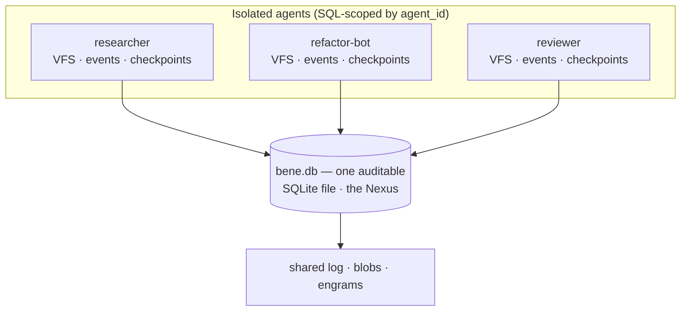
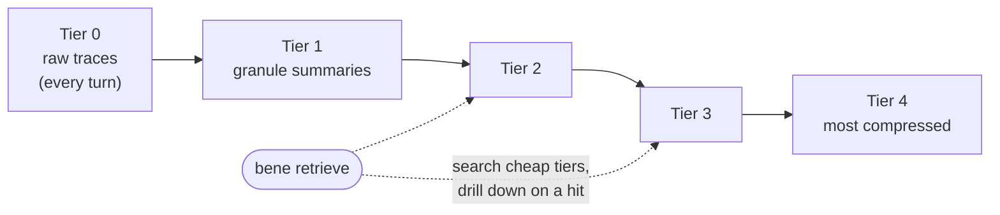
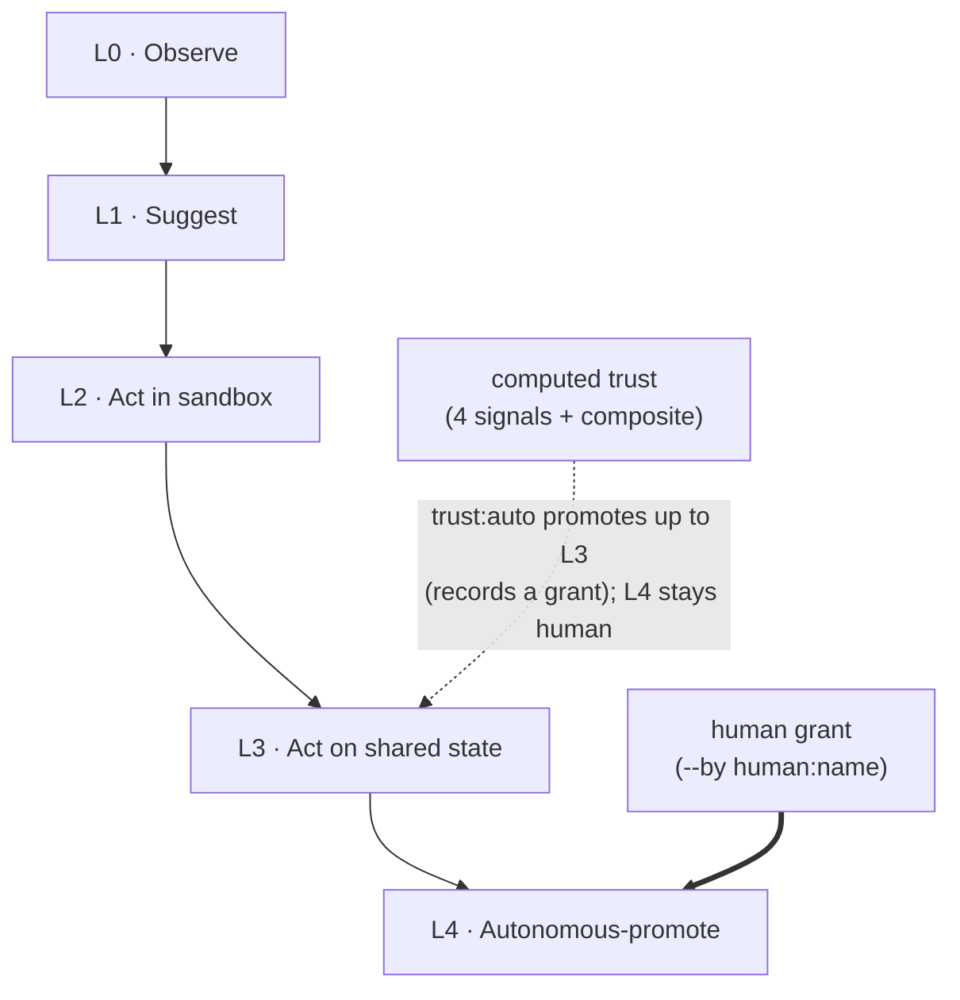

# 架构图解 (Architecture diagrams)

三张图，把 BENE 各部件怎么咬合到一起讲清楚：单文件的 **Nexus**、**engram 压缩阶梯（engram compression ladder）**，以及**自主权阶梯（autonomy ladder）**。图给的是骨架形状，正文则点明每张图到底在承担什么。

## Nexus —— 一群隔离的 agent，一个文件 (The Nexus — many isolated agents, one file)

每个 agent 都有自己的 VFS、事件日志、checkpoint 和 trace（执行轨迹）—— 但它们全都活在**同一个** SQLite 数据库里。这个单一文件就是 Nexus：整个 agent 蜂群的汇聚点，也是你拿来复制、diff、提交进 git 的那个东西。（WAL 模式会把最近的提交先攒在 `bene.db-wal` 这个旁路文件里，直到触发一次 checkpoint；所以在进程还活着的时候，要么先跑一次 WAL checkpoint（或直接关库）再单拷 `bene.db`，要么把 `-wal`/`-shm` 两个旁路文件一起带走。）

*它撑住了什么：* 每个 agent 自己的 `fs_*` 工具都被钉死在它的 `agent_id` 范围内，所以正常跑起来时，"多 agent、一文件" 并不意味着 agent 们会互相串门撞车。这只是逻辑上的命名空间隔离，不是硬性的授权边界 —— 运维侧的接口（`Bene.read`/`query`，以及 `agent_read`/`agent_write` 这两个 MCP 工具）接受一个显式的 `agent_id`，按设计就是可以跨 agent 读写的。这片联合视图本身，就是审计面。

## engram 压缩阶梯 (The engram compression ladder)

执行 trace 按一条分层阶梯（0–4 级）存放：最底层是原始数据，越往上是压得越狠的摘要。检索时先扫便宜的高层，命中了再往下钻到细节 —— 这样语料越长越大，记忆也始终能搜得动。

*它撑住了什么：* 捕获是默认行为（每跑一次都落一条 tier-0 trace），而这条阶梯就是让 "什么都记得住" 不至于退化成 "什么都得从头扫一遍" 的关键。

## 自主权阶梯（L0 → L4） (The autonomy ladder (L0 → L4))

agent 在某一档（rung）上运行。计算出来的信任度（四路信号 + 一个综合分）会抬高某个 agent 允许够到的下限 —— 但最顶上那档，也就是自主晋升，被**引擎硬性卡在 L4 之下**，只有人类授权才能跨过去。

*它撑住了什么：* 自主权是从观测到的实际行为里*挣*出来的，不是嘴上喊出来的。动到共享状态的动作落在 **L3**；而最顶上那档 —— **L4**，自主自我晋升 —— 永远绕不开一次人类授权。

---

*这些图都是 Mermaid，文档站会内联渲染。它们落在 `bene/kernel/harness/autonomy.py`（L0–L4 这套标签）、engram 分层模型，以及单文件 Nexus 的设计之上。源文件：改这份 markdown，永远别去动生成出来的 HTML。*
