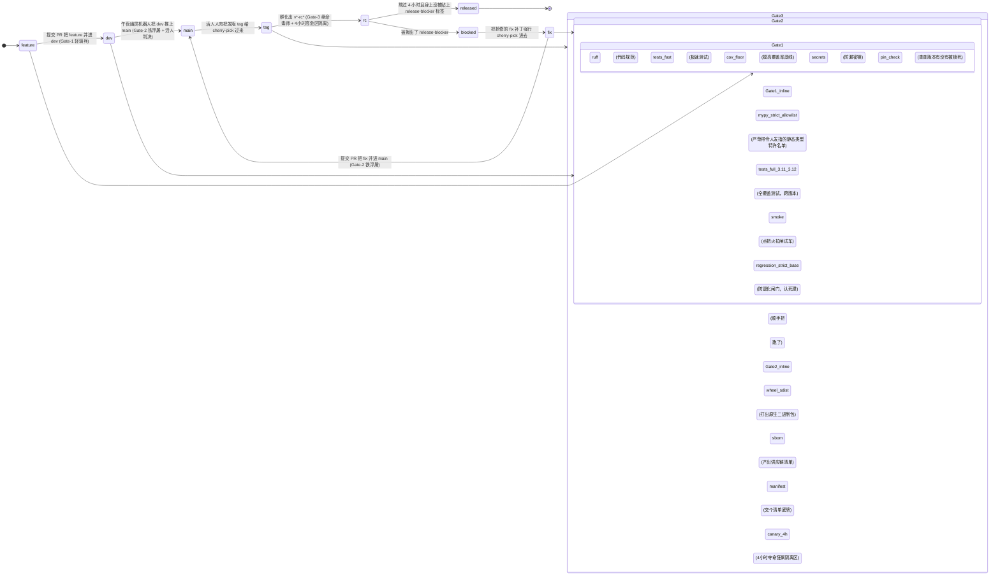

# 教程 t10 — 具备自愈能力的 CI 守夜人：防退化闸门、自动修补、以及代码审查与重构特种部队

*进阶教程 · 耗时 60–90 分钟*

---

你将把四个极其轻量级的 CI 任务焊进任何一个 Python 代码库里：

1. **防退化闸门 (regression-gate)** — 只要 PR 里的某项硬指标跌穿了警戒线，直接掐死构建。
2. **自动修补 (auto-fix)** — 直接把那些极其弱智的代码规范/格式化报错修掉，并自动提交到 PR 分支上。
3. **评审特种部队 (review-swarm)** — 4 位平行宇宙的评审老哥同时审码 (安全、稳定性、代码风格、测试覆盖度)。
4. **重构特种部队 (refactor-swarm)** — 一个报错文件发一只专属 agent，只做参谋，不强制提交。

每个任务满打满算也就大概 100 行代码 (LOC)。你不需要去折腾任何花里胡哨的新基建：只要有 GitHub Actions、一把 `uv`，以及一个大模型供应商的 API 密钥就够了。

如果你想扒一扒这些设计决策背后血淋淋的 *为什么 (Why)*，请出门左转翻阅 [案发现场复盘/cs02 — CI 自愈纪实](../case-studies/cs02-ci-self-healing-refactor-swarm.md)。而这篇教程，只手把手教你 *怎么做 (How)*。

> 如果下面提到的任何杀招让你觉得一头雾水，请先去翻阅旁边挂着的对应链接 — 它们也就 5-10 分钟的阅读量，看完后你再回来看这篇，就会有一种打通任督二脉的爽快感，不用反复咀嚼：
>
> - **`run_parallel`、人格面具分裂** → [教程/t03 — 安全攻防特种部队](t03-security-swarm.md)
> - **单兵沙盒级时光倒流** → [教程/t02 — 端到端自愈实战](t02-e2e-self-healing.md)
> - **死磕硬指标的防退化闸门** → [教程/t07 — 防退化闸门实战](t07-regression-guard.md)
> - **一文件一 agent 的大兵团作战** → [教程/t08 — 挑战百狼并发](t08-hundred-agents-scale.md)
> - **拿纯 SQL 拷问审计库** → [教程/t05 — 凌晨两点急救手册](t05-incident-response.md)

## 开打前的准备工作

- 一个已经挂上了 GitHub Actions 的 Python 代码库。
- 装好 BENE `>=0.1.0` (随你 `pip install bene`，或者拉下来 `uv sync` 都行)。
- 一把 LLM 供应商的库级别密钥 (比如 `ANTHROPIC_API_KEY`)。
- 在 `.github/workflows/` 这个目录上焊死了 `CODEOWNERS` 权限。

> **防翻车指南。** 先拉个没人管的废弃分支走一遍这个教程。这里面的每一步都是能单独拎出来跑的；千万别在一个 PR 里一口气把这四个大件全焊上去，容易把自己玩死。

## Step 1 — 挂上跑腿配置文件

新建一个 `.github/bene/bene-ci.yaml`：

```yaml
# 专供 CI 里的特种部队通过 BENE_CONFIG 环境变量来读取。
# 故意没有把它扔进 .github/workflows/ 里 — 因为扔进那里的任何东西都会被
# GitHub Actions 当成流水线自动跑。把它藏在 .github/bene/ 下面，既能用 CODEOWNERS 
# 卡死权限，又不会被当成什么倒霉催的 workflow。
provider: anthropic
api_key_env: ANTHROPIC_API_KEY
default_model: claude-sonnet-4-6
router:
  difficulty_thresholds:
    trivial: 0.2
    standard: 0.6
    hard: 0.85
  models:
    trivial:  claude-haiku-4-5
    standard: claude-sonnet-4-6
    hard:     claude-sonnet-4-6
```

把 `.github/bene/` 强行塞进 `CODEOWNERS` 名单里，这样路人提交 PR 时就没法在没有 review 的情况下偷偷篡改这玩意了。

> **防翻车指南。** 千万别把这玩意儿丢在代码库的根目录 (任何一个 PR 都能随手把它改了)，也绝对不要把它丢进 `.github/workflows/` (GitHub 只要看到里面有个 yaml 就会当流水线强行跑)。`.github/bene/` 是一个极其刁钻的绝佳藏身处：既能受到 CODEOWNERS 保护，又避开了 Actions 工作流的路口。

## Step 2 — 焊死防退化闸门 (5 分钟)

写个 `scripts/ci/regression_gate.sh`：

```bash
#!/usr/bin/env bash
set -euo pipefail
: "${BASE_REF:?必须要喂进来 BASE_REF}"

git fetch origin "$BASE_REF" --depth 1
git worktree add /tmp/base "origin/$BASE_REF"

base=$(uv run python -m your_pkg.metrics --quiet < /tmp/base)
head=$(uv run python -m your_pkg.metrics --quiet)
delta=$(python -c "print($head - $base)")

echo "基线得分=$base 狗头得分=$head 分差=$delta"
python -c "import sys; sys.exit(1 if $delta < -0.05 else 0)"
```

> **实战套路。** 如果你要拦的是 typecheck (类型检查) 的报警数量，把那个抓指标的命令换成 `uv run mypy . | grep -c error:`，然后记得把那个卡分差的符号反过来 (报警越多越该死)。

> **防翻车指南。** 永远只用 `git worktree add`，千万别用什么 `git checkout`。工作树 (worktree) 不会动你当前环境的一根汗毛，所以这任务里剩下的代码照样能岁月静好地读 `HEAD` 里的东西。

## Step 3 — 自动修补小分队 (5 分钟)

写个 `scripts/ci/auto_fix.sh`：

```bash
#!/usr/bin/env bash
set -euo pipefail
: "${BASE_BRANCH:?必须要喂进来 BASE_BRANCH}"

uv run ruff check --fix .
uv run ruff format .

if ! git diff --quiet; then
  git add -A -- '*.py' 'pyproject.toml'
  git -c user.email=ci@example.invalid -c user.name=ci-bot \
    commit -m "ci: 自动修补代码风格和格式化报错 [skip ci]"
  git push origin "HEAD:$BASE_BRANCH"
fi
```

> **防翻车指南。** `git add` 的时候，请老老实实地框定你真想让它顺手给你提交的文件类型。千万别闭着眼睛来发 `git add -A` —— 那些乱七八糟的自动生成文件绝对会不知不觉地混进你的提交里。

> **防翻车指南。** 那个 `[skip ci]` 标记是拿来保命的，它能防止你这个自动修补的提交触发第二次 CI 构建 —— 那种没完没了的 CI 死循环，百分之八十都是忘了加这句话惹的祸。

## Step 4 — 评审特种部队 (15 分钟)

写个 `scripts/ci/review_swarm.py`：

```python
#!/usr/bin/env python3
"""放出 4 位平行宇宙评审老哥；产出物: review-<职能>.md。"""
import asyncio, os, sys, pathlib
from bene import Bene
from bene.ccr import ClaudeCodeRunner
from bene.router import TierRouter

cfg = pathlib.Path(os.environ["BENE_CONFIG"]).resolve()
if os.environ.get("CI") == "true" and ".github/bene/" not in str(cfg):
    sys.exit("死活不认在 .github/bene/ 外面的 BENE_CONFIG")

PAYLOAD = ["scripts/ci/", ".github/workflows/ci.yml",
           ".github/bene/bene-ci.yaml"]
files = "\n\n".join(
    f"# {p}\n{pathlib.Path(p).read_text()}"
    for p in PAYLOAD if pathlib.Path(p).exists()
)

ROLES = {
    "security":    "给我往死里挖安全漏洞、密钥泄露、还有特么的供应链投毒风险",
    "reliability": "给我挖竞态条件、漏加的重试逻辑、还有那些假装没看见的错误吞噬",
    "style":       "喷代码风格、命名规范，还有那种看了想打人的不一致写法",
    "tests":       "缺了啥 CI 测试？哪里没被覆盖到在裸奔？",
}

async def main():
    db  = Bene("ci.db")
    ccr = ClaudeCodeRunner(db, TierRouter.from_config(str(cfg)))
    tasks = [
        {"name": role, "prompt": f"{instr}\n\n{files}"}
        for role, instr in ROLES.items()
    ]
    results = await ccr.run_parallel(tasks)

    out = pathlib.Path("review-out"); out.mkdir(exist_ok=True)
    for r in results:
        (out / f"review-{r['name']}.md").write_text(r.get("output", ""))

asyncio.run(main())
```

> **实战套路。** 刚开始玩的时候，给这群牲口喂的弹药尽量少点 —— 比如就丢进去 CI 脚本和 workflow 文件。等这帮家伙表现稳定了，再把针对 `BASE_REF` 的 diff (差异) 喂进去，让它们真的去审 PR。

> **防翻车指南。** 给这群大爷的职能提示词 (prompt) 必须尽量短，而且必须绝对正交 (不重叠)。如果你写了一长串，立马就会出现跨界串戏：查安全的老哥开始跟你瞎逼逼代码风格，查风格的老哥开始对漏掉的测试指指点点，结果就是你拿着四份极其雷同的废话报告，而不是四个针锋相对的专业视角。

> **顺藤摸瓜。** [教程/t03 — 安全攻防特种部队](t03-security-swarm.md) 里展现了这套平行评审的完整套路，并且用一条 SQL 查询就硬核自证了它们之间绝对不存在串门偷看。看一遍；你就再也不需要别人向你解释为什么在干这活时物理隔离这么重要了。

## Step 5 — 重构特种部队：拉清单 (5 分钟)

写个 `scripts/ci/manifest_from_mypy.sh`：

```bash
#!/usr/bin/env bash
set -euo pipefail
MAX_FILES="${MAX_FILES:-10}"
out="${1:-manifest.txt}"
errs="${2:-errors-by-file.txt}"

uv run mypy --no-color-output . > mypy.out || true

awk -F: '/error:/ {print $1}' mypy.out | sort -u | head -n "$MAX_FILES" > "$out"
awk -F: '/error:/ {print $1 "\t" $0}' mypy.out > "$errs"

echo "切出来的碎片 (shards): $(wc -l < "$out")"
```

> **实战套路。** 在前几次跑的时候，死死把 `MAX_FILES` 压低 (5–10)。当你一次性撒出 50 只碎片的时候，人肉 review 的成本高得令人发指，只有当你已经闭着眼睛都能信任那套单兵快照自尽回滚的流程后，这票买卖才划算。

> **顺藤摸瓜。** 去翻翻 [教程/t08 — 挑战百狼并发](t08-hundred-agents-scale.md) 看看在 847 个碎片规模下，怎么玩一文件一 agent 的大兵团作战，里面还有枢纽广播和代币成本的硬核算账。这是全网唯一一份能用人话给你讲明白为什么 "一个碎片 = 一个文件" 这条铁律毫无商量余地的神贴。

## Step 6 — 重构特种部队：大总管 (20 分钟)

写个 `scripts/ci/refactor_swarm.py`：

```python
#!/usr/bin/env python3
"""报错的文件一人认领一个；每个人发一个独立的 git worktree (工作树)；只负责给意见，不硬推。"""
import argparse, asyncio, json, os, pathlib, subprocess, sys
from bene import Bene
from bene.ccr import ClaudeCodeRunner
from bene.router import TierRouter

cfg = pathlib.Path(os.environ["BENE_CONFIG"]).resolve()
if os.environ.get("CI") == "true" and ".github/bene/" not in str(cfg):
    sys.exit("死活不认在 .github/bene/ 外面的 BENE_CONFIG")

WT_ROOT = pathlib.Path(".orchestra/refactor/worktrees")
WT_ROOT.mkdir(parents=True, exist_ok=True)

def make_worktree(shard: str) -> pathlib.Path:
    wt = WT_ROOT / shard.replace("/", "_")
    if not wt.exists():
        subprocess.check_call(["git", "worktree", "add", "-d", str(wt), "HEAD"])
    return wt

def mypy_count(path: pathlib.Path, target: str) -> int:
    out = subprocess.run(
        ["uv", "run", "mypy", "--no-color-output", target],
        cwd=path, capture_output=True, text=True
    ).stdout
    return sum(1 for line in out.splitlines() if "error:" in line)

async def shard_task(shard: str, errors: str):
    wt = make_worktree(shard)
    before = mypy_count(wt, shard)
    return {
        "name": shard,
        "prompt": (
            f"去把 {shard} 里的那堆类型报错给修了。只能碰这个文件，别瞎动其他的。 "
            f"别给老子格式化代码。别加乱七八糟的新依赖库。\n\n{errors}"
        ),
        "cwd": str(wt),
        "before": before,
    }

async def main(apply: bool):
    manifest = pathlib.Path("manifest.txt").read_text().splitlines()
    errs = dict(
        (l.split("\t", 1)[0], l) for l in
        pathlib.Path("errors-by-file.txt").read_text().splitlines()
    )

    db  = Bene("refactor.db")
    ccr = ClaudeCodeRunner(db, TierRouter.from_config(str(cfg)))
    tasks = await asyncio.gather(*[shard_task(s, errs.get(s, "")) for s in manifest])
    results = await ccr.run_parallel(tasks)

    kept, discarded = [], []
    out = pathlib.Path("swarm-out"); (out / "patches").mkdir(parents=True, exist_ok=True)
    for r, t in zip(results, tasks):
        wt = pathlib.Path(t["cwd"])
        after = mypy_count(wt, t["name"])
        diff = subprocess.check_output(["git", "-C", str(wt), "diff"], text=True)
        if after < t["before"] and diff.strip():
            (out / "patches" / f"{t['name'].replace('/', '_')}.patch").write_text(diff)
            kept.append({"shard": t["name"], "before": t["before"], "after": after})
        else:
            discarded.append({"shard": t["name"], "before": t["before"], "after": after})

    (out / "summary.json").write_text(json.dumps({"kept": kept, "discarded": discarded}, indent=2))
    (out / "summary.md").write_text(
        f"# 重构特种部队战报\n\n采纳 (Kept): {len(kept)}  毙掉 (Discarded): {len(discarded)}\n"
    )

    if apply and kept:
        for p in sorted((out / "patches").glob("*.patch")):
            subprocess.check_call(["git", "apply", str(p)])

if __name__ == "__main__":
    ap = argparse.ArgumentParser()
    ap.add_argument("--apply", action="store_true")
    asyncio.run(main(ap.parse_args().apply))
```

> **保命指南。** `verify-before-keep` (保留前先强制验货) 这一步是这整个文件里最最值钱的一条命脉：
>
> ```python
> if after < t["before"] and diff.strip(): ...
> ```
>
> 如果没了这行，那些装得很像样、但其实根本没卵用，压根就没修掉报错的垃圾代码，就会直接被强行推进代码库。

> **防翻车指南。** 永远从 `HEAD` 上直接切个挂空的 (detached) 工作树出来，别特么从什么带着名字的分支上切。挂空的工作树就像擦屁股纸，用完扔了毫不心疼。

> **顺藤摸瓜。** [教程/t02 — 端到端自愈实战](t02-e2e-self-healing.md) 里展现了完全一样的 "毙掉一个翻车的倒霉蛋，却绝不伤及隔壁兄弟" 的神级属性，只不过那边用的是 BENE 原生 VFS 快照。我们这里的 git-worktree 其实就是它在真实文件系统上的丐版替代品 — t02 只要 3 分钟就能让你彻底参透什么叫沙盒级回滚。

> **顺藤摸瓜。** [教程/t07 — 防退化闸门实战](t07-regression-guard.md) 是把那个验货闸门 (`verify-before-keep`) 糊在基准跑分套件上最廉价、最立竿见影的实盘案例。如果你觉得上面那句简陋的 `if after < before` 看起来太敷衍，去抄 t07 里的代码就行了。

## Step 7 — 焊接到流水线上 (10 分钟)

往 `.github/workflows/ci.yml` 的尾巴上追加：

```yaml
jobs:
  regression-gate:
    runs-on: ubuntu-latest
    if: github.event_name == 'pull_request'
    permissions: { contents: read }
    concurrency: { group: regression-${{ github.ref }}, cancel-in-progress: true }
    steps:
      - uses: actions/checkout@v4
        with: { fetch-depth: 0 }
      - run: BASE_REF=${{ github.base_ref }} bash scripts/ci/regression_gate.sh

  auto-fix:
    runs-on: ubuntu-latest
    if: github.event_name == 'pull_request'
    permissions: { contents: write }
    steps:
      - uses: actions/checkout@v4
        with: { ref: ${{ github.head_ref }} }
      - run: BASE_BRANCH=${{ github.head_ref }} bash scripts/ci/auto_fix.sh

  review-swarm:
    runs-on: ubuntu-latest
    if: github.event_name == 'pull_request'
    permissions: { contents: read }
    env:
      BENE_CONFIG: .github/bene/bene-ci.yaml
      ANTHROPIC_API_KEY: ${{ secrets.ANTHROPIC_API_KEY }}
    steps:
      - uses: actions/checkout@v4
      - run: uv run python scripts/ci/review_swarm.py
      - uses: actions/upload-artifact@v4
        with: { name: review-out, path: review-out/ }

  refactor-swarm:
    runs-on: ubuntu-latest
    if: github.event_name == 'pull_request'
    permissions: { contents: read }
    env:
      BENE_CONFIG: .github/bene/bene-ci.yaml
      ANTHROPIC_API_KEY: ${{ secrets.ANTHROPIC_API_KEY }}
      MAX_FILES: "10"
    steps:
      - uses: actions/checkout@v4
        with: { fetch-depth: 0 }
      - run: bash scripts/ci/manifest_from_mypy.sh manifest.txt errors-by-file.txt
      - run: uv run python scripts/ci/refactor_swarm.py
      - uses: actions/upload-artifact@v4
        with:
          name: swarm-out
          path: |
            swarm-out/
            refactor.db
```

> **防翻车指南。** 给每个任务老老实实地挂上 `concurrency`。不然的话，要是有人手贱连着推了好几次提交，就会有好几批并行的特种部队在同一个 PR 上发生惨绝人寰的大乱斗。

> **防翻车指南。** 每个 job 各自拿好自己的 `permissions:`。`auto-fix` 是唯一一个敢问你要 `contents: write` 写入大权的活宝。

## Step 8 — 在本地抽一鞭子 (5 分钟)

在把这堆玩意推上云端前，先跑一遍静态检查；这能把你送上 CI 处刑台前 90% 的低级错误给拦下来。

```bash
bash -n scripts/ci/regression_gate.sh
bash -n scripts/ci/auto_fix.sh
bash -n scripts/ci/manifest_from_mypy.sh

uv run python -c "import ast, pathlib; \
[ast.parse(p.read_text()) for p in pathlib.Path('scripts/ci').glob('*.py')]"

# 拉清单这个脚本完全是离线的，可以直接跑一把看看效果:
bash scripts/ci/manifest_from_mypy.sh manifest.txt errors-by-file.txt
wc -l manifest.txt errors-by-file.txt

yamllint .github/workflows/
```

## Step 9 — 拷问审计库

在一波 CI 跑完后，把那个叫 `swarm-out` 的包裹扒下来，拿随便什么能连 SQLite 的工具打开 `refactor.db`：

```sql
-- 算一算每只特种兵烧了你多少钱
SELECT a.name, SUM(tc.token_count) AS tokens
FROM agents a JOIN tool_calls tc USING (agent_id)
GROUP BY a.name ORDER BY tokens DESC;

-- 查阵亡名单
SELECT a.name, tc.tool_name, tc.error_message
FROM agents a JOIN tool_calls tc USING (agent_id)
WHERE tc.status = 'error'
ORDER BY tc.timestamp;

-- 查这帮家伙跨界偷学了什么心得
SELECT a.name, f.path, f.size
FROM agents a JOIN files f USING (agent_id)
WHERE f.path LIKE '/discoveries/%';
```

> **实战套路。** 把这些 SQL 咒语保存在 `docs/runbook.md` 里。别指望那帮审 PR 的家伙有闲情逸致在案发现场临时现写 SQL。

> **顺藤摸瓜。** 去翻翻 [教程/t05 — 凌晨两点急救手册](t05-incident-response.md)，里面也是拿着这些拷问审计库的 SQL 咒语，在 12 秒内直接硬干出了真凶。里面的查询套路原封不动直接抄。如果你想自己捏点花样，去翻翻 [数据库解剖图](../schema.md)，那是手把手按列扒光的骨架参考。

## Step 10 — 三段式闸门防线打法

上面糊上去的那四个 CI 任务只不过是极其基础的积木原件。至于怎么把它们摆在你的分支工作流里，那是个极其见血见的兵法问题。我们在实盘里敲定的是一套 "三段式闸门" 的沙盘推演：**Gate-1 轻骑兵** (专门伺候 Feature PR)，**Gate-2 铁浮屠** (专门卡 Fix PR 和合并回 main 的操作)，**Gate-3 绝命毒师** (专卡打 Tag 发版)。每道门都有着极其冷酷的契约，以及极其明晰的保命逃生口。



每道门都死死映射到一个入口的 workflow (流水线)，外加一个随叫随到的复用级 (reusable) workflow：

| 闸门编号 | 怎么被引爆的 | 入口级 workflow | 随叫随到的复用级 workflow | 掐表限时 |
|---|---|---|---|---|
| 1 — 轻骑兵 | 向 `dev` 提交的 `pull_request` | `pr-feature.yml` | `reusable-fast-gate.yml` | < 5 分钟 |
| 2 — 铁浮屠 | 向 `main` 提交的 `pull_request`，或是硬推 `push: dev`，午夜幽灵 | `pr-fix.yml`, `push-dev.yml`, `nightly-promote.yml` | `reusable-strict-gate.yml` | < 20 分钟 |
| 3 — 绝命毒师 | 只要打了形如 `v*` 的 `push: tags` | `release-tag.yml` | `reusable-release.yml` | 铁律底线 + 4 小时的 RC 隔离高压锅 |

这套破玩意儿之所以没有散架，全靠三大祖宗之法护体：

1. **绝对禁止套娃式的复用调用。** GitHub 那些奇葩的组织级私有 Runner 有时候对这种套娃调用极度水土不服 (解析器一看到深坑嵌套里的 `secrets: inherit` 就炸，或者在商城里下不来插件)。每个入口 workflow 永远只能叫出 *一个* 顶层的 reusable ；而那个 reusable 必须一口气把底下该干嘛全都写死在自己文件里。Karpathy 的极简暴力哲学在这赢麻了 —— 少写几个破文件，就少一万个被解析器气到吐血的惊喜。
2. **"基线没见绿" 默认只当吹哨警告，必须手动拉下严打死限才会出人命。** `main` 上的偶发抽风 (flake) 绝不能像病毒一样把下面每条 Feature PR 的极速闸门全给引爆了。一旦系统发现父级基线是红的，系统默认只会悄无声息地抛出一个 `rc=5` (纯属提醒，我不搞你)。如果到了 Gate-2 这种生死关头，强行拉下了 `BENE_STRICT_BASE=1` 的死限，那它就会变异成 `rc=4` (当场赐死)。这直接捏死了那个该死的终极死循环："`main` 自己就是个烂摊子，导致下面所有的 PR 都特么红着脸根本合不进去救 `main`。"
3. **一旦并入主干，覆盖率底裤只准越穿越高 (post-merge ratchet)。** 每当合并落地，`push-main.yml` 就会像幽灵一样爬起来清算，量出覆盖率的新高度，然后把 `.coverage-floor` 的底线往上再拔最多 5 个点 (但被死死按在了 98 的天花板下)。这条底线只能像棘轮一样往上拧，这辈子别想往下掉。接下来的任何一条 PR 只要敢穿得比这条新底线还要低，Gate-1 会直接一刀把它脑袋剁了。

那三个复用的流水线极其瘦骨嶙峋。`reusable-fast-gate.yml` 撑死也就 80 行；`reusable-strict-gate.yml` 170 行封顶；`reusable-release.yml` 也就区区 120 行。哪怕是条狗，只要点开它们看一眼，就能毫不费力、没有弯弯绕绕地看穿它们到底背着你干了什么勾当。

> **防翻车指南。** 你的分支保护规则 (branch protection) 必须咬死在那些具体的 *任务名 (job names)* 上 (比如 `ci/fast`, `ci/strict/tests-3.11`, `ci/strict/mypy`，诸如此类)，而绝不是那个 workflow 文件的破名字上。只有这样，当你闲得蛋疼去把某个 workflow 改了个名时，才不会像个傻X一样悄无声息地把最致命的安全防线给废了。

## 排雷指南 (Troubleshooting)

| 吐了什么血 (Symptom) | 八成是哪个倒霉催的弄的 (Likely cause) | 该怎么治 (Fix) |
|---|---|---|
| `死活不认在 .github/bene/ 外面的 BENE_CONFIG` | 配置文件被人挪地方了，或者环境变量被人黑了 | 把那个破文件请回 `.github/bene/` 供着；别特么用什么乱七八糟的环境变量去强行覆盖 `BENE_CONFIG` |
| 自动修补死循环了 | 你自己拉出的屎又把自己绊倒了 (自动提交的那个操作又把 CI 重新叫起来了) | 赶紧在提交信息的尾巴上补一句 `[skip ci]`；或者索性加个判断：只要是你家的 bot 写的，就直接掐掉任务 |
| 重构大军交卷了：保留的补丁数 (kept) 是 0 | `mypy` 报的错在这帮家伙折腾完之后压根就没少 | 把 `MAX_FILES` 往下压一压；拿眼皮夹一下 `errors-by-file.txt` 里到底报了些什么鬼东西；把给它们的提示词 (prompt) 写得再变态一点 |
| `yamllint` 被气炸了 | 要么单行长得像老太婆的裹脚布，要么缩进跟狗啃的一样 | 把 `yamllint` 拿下来在本地狠狠地抽一遍；把那些贼长的字符串老老实实折成多行 |
| 评审老哥集体甩出 401 报错 | 你把 `ANTHROPIC_API_KEY` 仓库级密钥给忘了 | 滚去 repo 的 Settings → Secrets 里面把它贴上去 |
| 工作树 (Worktree) 已存在，死活切不出来 | 上一次跑完留下的烂摊子没收拾干净 | 在开跑前的清理步骤里甩一句 `git worktree prune` |
| 提交的差异 (diffs) 里全是在擅自帮你重新排版 | 有个脑子不清醒的 agent 把你整个文件给重写了 | 在提示词里破口大骂，严禁它干格式化的活；如果它交上来的补丁行数超出了容忍度，当场把它毙了 |

## 第二阶段火力全开的野路子 (本教程不教)

- **一路绿灯，自动并入主干：** 把那个极其危险的 `--apply` 参数死死封印在特定的标签 (labels) 或者是强制必须有人点赞 (required reviews) 的关卡背后。
- **让活人看懂：** 调用 GitHub 的 API，把评审特种部队在地下室查出的脏东西，堂而皇之地以评论的形式贴在 PR 上。
- **神仙打架 (Co-evolution)：** 直接撒出 N 拨重构大军，每一拨喂给它们一套截然不同的提示词打法；赢的留下来，让它们在死人堆里通过那个地下枢纽 (discoveries hub) 疯狂互抄绝技。

## 顺藤摸瓜

为了不让你瞎点，我把每个链接能让你掏出什么真本事都写得明明白白的：

- [案发现场复盘/cs02 — CI 自愈纪实](../case-studies/cs02-ci-self-healing-refactor-swarm.md) — *为什么这么搞 (the why).* 全是设计上的血泪史、我们之前翻过什么车、供应链上的铁律，以及如何把这套打法向其他兄弟团队甩锅。你想瞎改这套流水线前，先把这个背得滚瓜烂熟。
- [教程/t08 — 挑战百狼并发](t08-hundred-agents-scale.md) — *摸摸天花板 (the limit).* 当你把碎片狂拉到 847 块时到底会发生什么灵异事件，以及为什么 "一文件配一狼" 这条底线绝不接受反驳。
- [教程/t02 — 端到端自愈实战](t02-e2e-self-healing.md) — *沙盒里的时光倒流 (the rollback model).* 0.3 秒内把犯错的 agent 当场重启；这种安全感，就是你在这里花式用 git worktree 所追求的最高境界。
- [教程/t03 — 安全攻防特种部队](t03-security-swarm.md) — *精神分裂的职能，附带硬核自证 (the role split, with proof).* 零跨界偷看、严苛的锚定偏差 (anchoring-bias) 量化测量、还有极其暴力的 SQL 聚合统计。
- [教程/t07 — 防退化闸门实战](t07-regression-guard.md) — *硬刚指标的防线 (the metric gate).* 在极其恶劣的环境下，演示什么叫 "敢过警戒线就当场毙了"。
- [教程/t05 — 凌晨两点急救手册](t05-incident-response.md) — *那些拿着纯 SQL 拷问审计库的神级咒语 (audit-DB SQL patterns)*，你可以不经过大脑，直接复制粘贴到你那本救命用的排障手册 (runbook) 里。
- [快照系统](../checkpoints.md), [数据库解剖图](../schema.md) — 这是那些极其硬核的底层解剖图纸。
- [破局战法 — 具备自愈能力的 CI](../use-cases.md#self-healing-ci-regression-gate-auto-fix-review-and-refactor-swarms) — 整个江湖上关于这些打法的索引目录。
